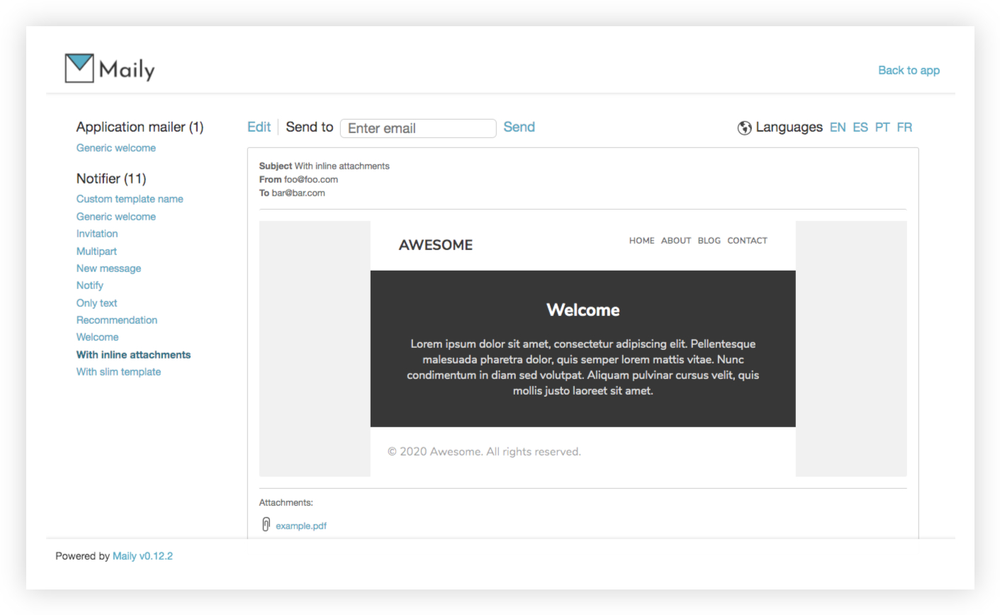

<div>
  <p align="center">
    
  </p>
  <p align="center">
    <a href="https://rubygems.org/gems/maily"></a>
    <a href="https://travis-ci.org/markets/maily"></a>
    <a href="https://codeclimate.com/github/markets/maily/maintainability"></a>
    <a href="https://github.com/markets/maily/blob/master/MIT-LICENSE"></a>
  </p>
</div>

Maily is a Rails Engine to manage, test and navigate through all your email templates of your app, being able to preview them directly in your browser.

Maily automatically picks up all your emails and make them accessible from a kind of dashboard.

## Features:

* Mountable engine
* Visual preview in the browser (attachments as well)
* Template edition (only in development)
* Email delivery
* Features configurables per environment
* Flexible authorization system
* Minimalistic and clean interface
* Easy way (aka `hooks`) to define and customize data for emails
* Generator to handle a comfortable installation



## Installation

Add this line to your `Gemfile` and then run `bundle install`:

```ruby
gem 'maily'
```

Run generator:

```
> rails g maily:install
```

This generator runs some tasks for you:

* Mounts the engine (to `/maily` by default) in your routes
* Adds an initializer (into `config/initializers/maily.rb`) to customize some settings
* Adds a file (into `lib/maily_hooks.rb`) to define hooks

## Initialization and configuration

You should use the `setup` method to configure and customize `Maily` settings:

 ```ruby
# config/initializers/maily.rb
Maily.setup do |config|
  # On/off engine
  # config.enabled = !Rails.env.production?

  # Allow templates edition
  # config.allow_edition = !Rails.env.production?

  # Allow deliveries
  # config.allow_delivery = !Rails.env.production?

  # Your application available_locales (or I18n.available_locales) by default
  # config.available_locales = [:en, :es, :pt, :fr]

  # Run maily under different controller ('ActionController::Base' by default)
  # config.base_controller = '::AdminController'

  # Configure hooks path
  # config.hooks_path = 'lib/maily_hooks.rb'

  # Http basic authentication (nil by default)
  # config.http_authorization = { username: 'admin', password: 'secret' }

  # Customize welcome message
  # config.welcome_message = "Welcome to our email testing platform. If you have any problem, please contact support team at support@example.com."
end
```

You can use the following format too:

```ruby
Maily.enabled = ENV['MAILY_ENABLED']
Maily.allow_edition = false
```

### Templates edition (`allow_edition` option)

This feature was designed for the `development` environment. Since it's based on just a file edition, and while running in `production` mode, code is not reloaded between requests, Rails doesn't take into account your changes (without restarting the server). Actually, allowing arbitrary Ruby code evaluation is potentially dangerous, and that's not a good idea in `production`.

So, template edition is not allowed outside of the `development` environment.

## Hooks

Most of emails need to populate some data to consume it and do interesting things. Hooks are used to define this data via a little DSL. Hooks also accept "callable" objects to *lazy* load variables/data, so each email will evaluate its hooks on demand. Example:

```ruby
# lib/maily_hooks.rb
user = User.new(email: 'user@example.com')
lazy_user = -> { User.with_comments.first } # callable object, lazy evaluation
comment = Struct.new(:body).new('Lorem ipsum') # stub way
service = FactoryGirl.create(:service) # using fixtures with FactoryGirl

Maily.hooks_for('Notifier') do |mailer|
  mailer.register_hook(:welcome, user, template_path: 'users')
  mailer.register_hook(:new_comment, lazy_user, comment)
end

Maily.hooks_for('PaymentNotifier') do |mailer|
  mailer.register_hook(:invoice, user, service)
end
```

Note that you are able to override the `template_path` and the `template_name` like can be done in Rails. You must pass these options as a hash and last argument:

```ruby
Maily.hooks_for('YourMailerClass') do |mailer|
  mailer.register_hook(:a_random_email, template_path: 'notifications')
  mailer.register_hook(:another_email, template_name: 'email_base')
end
```

### Email description

You can add a description to any email and it will be displayed along with its preview. This is useful in some cases like: someone from another team, for example, a marketing specialist, visiting Maily to review some texts and images; they can easily understand when this email is sent by the system.

```ruby
Maily.hooks_for('BookingNotifier') do |mailer|
  mailer.register_hook(:accepted, description: "This email is sent when a reservation has been accepted by the system." )
end
```

### Hide emails

You are also able to hide emails:

```ruby
Maily.hooks_for('Notifier') do |mailer|
  mailer.hide_email(:sensible_email, :secret_email)
end
```

### Use `params`

Support for [`ActionMailer::Parameterized`](https://api.rubyonrails.org/classes/ActionMailer/Parameterized.html) is possible via `with_params` hash:

```ruby
message = -> { 'Hello!' }

Maily.hooks_for('Notifier') do |mailer|
  mailer.register_hook(:new_message, with_params: { message: message })
end
```

### External emails

If you want to register and display in the UI, emails from external sources, like for example a gem, you can do it by adding a hook. Example:

```ruby
Maily.hooks_for('Devise::Mailer') do |mailer|
  mailer.hide_email(:unlock_instructions)

  mailer.register_hook(:reset_password_instructions, user, 'random_token')
  mailer.register_hook(:confirmation_instructions, user, 'random_token')
  mailer.register_hook(:password_change, user)
end
```

## Authorization

Basically, you have 2 ways to restrict access to the `Maily` section. You can even combine both.

### Custom base controller

By default `Maily` runs under `ActionController::Base`, but you are able to customize that parent controller (`Maily.base_controller` option) in order to achieve (using, for example, `before_action` blocks) a kind of access control system. For example, set a different base controller:

```ruby
Maily.base_controller = '::SuperAdminController'
```

And then write your own authorization rules in this defined controller:

```ruby
class SuperAdminController < ActionController::Base
  before_action :maily_authorized?

  private

  def maily_authorized?
    current_user.admin? || raise("You don't have access to this section!")
  end
end
```

### HTTP basic authentication

You can also authorize yours users via HTTP basic authentication, simply use this option:

```ruby
Maily.http_authorization = { username: 'admin', password: 'secret' }
```

## Notes

Rails 4.1 introduced a built-in mechanism to preview the application emails. It is in fact, a port of [basecamp/mail_view](https://github.com/basecamp/mail_view) gem to the core.

Alternatively, there are more gems out there to get a similar functionality, but with different approaches and features. Like for example, [ryanb/letter_opener](https://github.com/ryanb/letter_opener), [sj26/mailcatcher](https://github.com/sj26/mailcatcher) or [glebm/rails_email_preview](https://github.com/glebm/rails_email_preview).

## Development

Any kind of feedback, bug report, idea or enhancement are really appreciated :tada:

To contribute, just fork the repo, hack on it and send a pull request. Don't forget to add tests for behaviour changes and run the test suite:

```
$ bundle exec rake
```

Run the test suite against all supported versions:

```
$ bundle exec appraisal install
$ bundle exec appraisal rake
```

Run specs against specific version:

```
$ bundle exec appraisal rails-6.0 rake
```

### Demo

Start a sample Rails app ([source code](spec/dummy)) with `Maily` integrated:

```
$ bundle exec rake web # PORT=4000 (default: 3000)
```

## License

Copyright (c) Marc Anguera. Maily is released under the [MIT](MIT-LICENSE) License.
