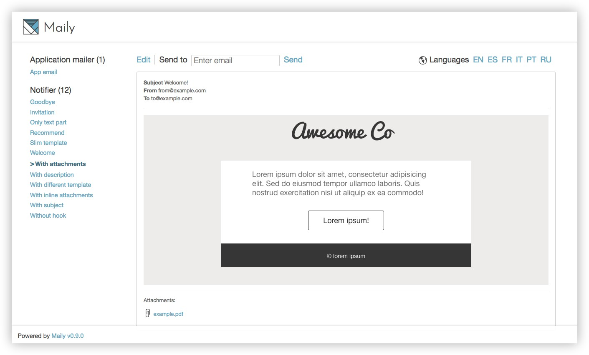

Maily
==============

Stop to delivery emails every time you change it!

Maily is Rails Engine to preview, follow up, test and edit the emails of your applications in a browser. Features:

* Mountable engine
* Visual preview in the browser (attachments as well)
* Template edition
* Email delivery
* Features configurables per environment
* Customizable parent controller (define permissions in your own controller)
* Minimalistic interface (thanks to [@gnatok](https://github.com/gnatok))
* Easy way (named hooks) to define data for emails
* Generator to handle a comfortable installation



## Installation
Add this line to you Gemfile:

```
gem 'maily'
```

Run generator:

```
rails g maily:install
```

This installator mounts the engine:

```
mount Maily::Engine, at: 'maily'
```

Adds an initializer to customize some settings:

```ruby
# config/initializers/maily.rb
Maily.setup do |config|
  # Enable/disable engine
  # config.enabled = Rails.env.production? ? false : true

  # Allow to edit templates
  # config.allow_edition = Rails.env.production? ? false : true

  # Allow deliveries
  # config.allow_delivery = Rails.env.production? ? false : true

  # Define I18n available locales
  # config.available_locales = [:en, :es, :pt, :fr]

  # Define parent controller. Allow to run engine under a custom controller
  # config.base_controller = 'FooController'
end
```

And adds a file to define hooks.

## Hooks
Most of emails need to populate data to consume it and do intersting things. Hooks are used to define this data with a little DSL. Example:

```ruby
# lib/maily_hooks.rb
user = User.new(email: 'user@example.com')
comment = Struct.new(:body).new('Lorem ipsum') # stub way
service = Service.new(price: '100USD')

Maily.hooks_for('Notifier') do |mailer|
  mailer.register_hook(:welcome, user, template_path: 'users')
  mailer.register_hook(:new_comment, user, comment)
end

Maily.hooks_for('PaymentNotifier') do |mailer|
  mailer.register_hook(:invoice, user, service)
end
```

## License
Copyright (c) 2013 Marc Anguera. Maily is released under the [MIT](MIT-LICENSE) License.